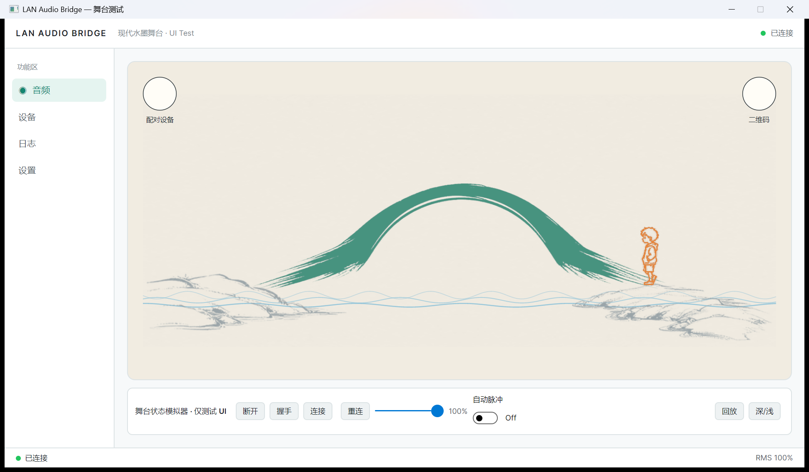
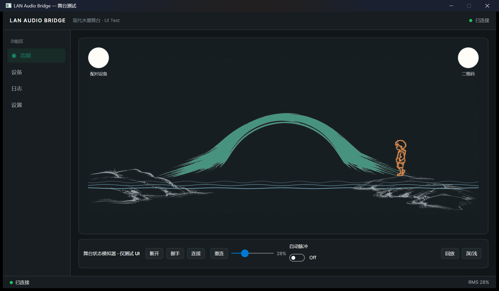

# 墨堤互联 · MoDi Connect

> **跨设备音频互联协议与双端应用** —— 让手机与电脑之间的声音，流动得更自然。

[](LICENSE)
[](https://github.com/DSGYDS/MoDi-Connect-Protocol)
[]()
[](https://modiconnect.cn)

**[官网](https://modiconnect.cn)** · **[下载](https://github.com/DSGYDS/MoDi-Connect/releases)** · **[协议规范](https://github.com/DSGYDS/MoDi-Connect-Protocol)**

墨堤互联是一款开源的跨设备音频互联软件：把手机里的系统声音、麦克风声音，通过**家庭网络 / Wi-Fi Direct / 蓝牙 / USB** 任意一种链路，实时传到电脑上播放，或送入虚拟麦克风供任意软件使用。

---

## ✨ 功能特性

- **四条互联链路**
  - **在家**：局域网 mDNS 自动发现电脑，即开即用
  - **万能**：扫码配对（Wi-Fi Direct），无路由器也能直连
  - **蓝牙 / USB**：经典硬件链路，覆盖无网络场景
- **四种采集路线**
  - 系统音频 → 电脑扬声器
  - 系统音频 + 麦克风混音 → 电脑扬声器
  - 手机麦克风 → 电脑虚拟麦克风（游戏/会议/直播连麦）
  - 系统音频 → 电脑虚拟麦克风
- **低延迟音频链路**：Opus 编码 + JitterBuffer 抗抖动 + FEC 丢包恢复
- **现代水墨风 UI**：Windows / Android 统一设计语言（五字体体系、深浅双主题）
- **推流中热切换**：路线、链路随时切换，不断流

## 📸 截图

| 连接中 · 水墨舞台（浅色） | 深色主题 |
|:---:|:---:|
|  |  |

---

## 🚀 快速开始

### Windows 端

1. 从 [Releases](https://github.com/DSGYDS/MoDi-Connect/releases) 下载 `MoDi.Setup.community.1.0.0.exe`
2. 运行安装（安装包已内置 .NET 运行时，无需预装任何环境）
3. 如需要使用**虚拟麦克风**（路线 3 / 4），安装完成时勾选运行 **VB-CABLE 引导**（从官方渠道静默安装）

### Android 端

1. 从 [Releases](https://github.com/DSGYDS/MoDi-Connect/releases) 下载 `MoDi.Connect.android-1.0.0-community.apk` 并安装
2. 打开应用，选择链路：
   - **在家**：自动发现局域网中的电脑，点击即可连接
   - **万能**：扫码配对（需电脑端显示二维码）
   - **蓝牙 / USB**：完成硬件连接后选择对应链路
3. 选择一条**路线**，点击推流
4. 电脑端自动接收：扬声器路线直接出声；虚拟麦克风路线请在目标软件中选择 **CABLE Output** 作为输入设备

### 常见用法

| 场景 | 链路 | 路线 |
|------|------|------|
| 把手机声音放电脑音箱 | 在家 | 路线 1（系统音频） |
| 游戏 / 会议连麦 | 万能 | 路线 3（麦克风 → 虚拟麦克风） |
| 手机直播伴奏进电脑 | 蓝牙 | 路线 4（系统音频 → 虚拟麦克风） |

---

## 🔧 从源码构建

### Windows

```bash
dotnet publish windows/MoDi.Desktop/MoDi.Desktop.csproj \
  -c Release -r win-x64 --self-contained true \
  -p:DebugSymbols=false -p:DebugType=None
```

### Android

```bash
cd android
./gradlew :app:assembleRelease
```

> 协议以固定版本二进制（0.1.1）引用，构建前请先放置于 `third_party/modi-protocol/`（见下）。

## 📁 项目结构

```
├── windows/          # Windows 端（Avalonia + C#）
│   ├── MoDi.Desktop/        # 真实应用（接收/配对/音频/路由）
│   ├── MoDi.Presentation/   # 共享水墨 UI（五字体/设计令牌/舞台）
│   └── MoDi.App.Contracts/  # 平台无关契约
├── android/          # Android 端（Jetpack Compose + Kotlin）
│   └── app/src/main/        # 采集/编码/四链路/水墨 UI
├── content/          # 双端共享 Markdown 内容（故事/支持/赞助）
├── third_party/modi-protocol/  # 协议 0.1.1 二进制 + 许可文本
└── scripts/          # 验证/发布脚本
```

## 📄 许可证

- **应用**（本仓库代码）：[GPL-3.0-or-later](LICENSE)
- **MoDi Protocol 0.1.1**：专有许可。应用以二进制形式引用，使用与再分发遵循
  `Licenses/MoDi.Protocol/` 下的 `BINARY-REDISTRIBUTION-GRANT.txt` 与
  `MODI-PROTOCOL-BINARY-LINKING-EXCEPTION-1.0.txt`

## 🏠 社区版说明

- 本仓库为**社区版**：源码开放、可自由构建，**不包含自动更新机制**
- 自动更新与官方增值服务由**官方发行版**提供（见官网 [modiconnect.cn](https://modiconnect.cn)）

## ⚠️ 免责声明

本软件仅用于合法、正当的设备互联场景。请勿将本软件用于任何未经授权的录音、监听或侵犯他人隐私的行为。开发者不对任何滥用行为负责。

---

**墨堤互联** —— 从一个声音桥接的想法出发，希望不同设备之间的声音，流动得更自然。
