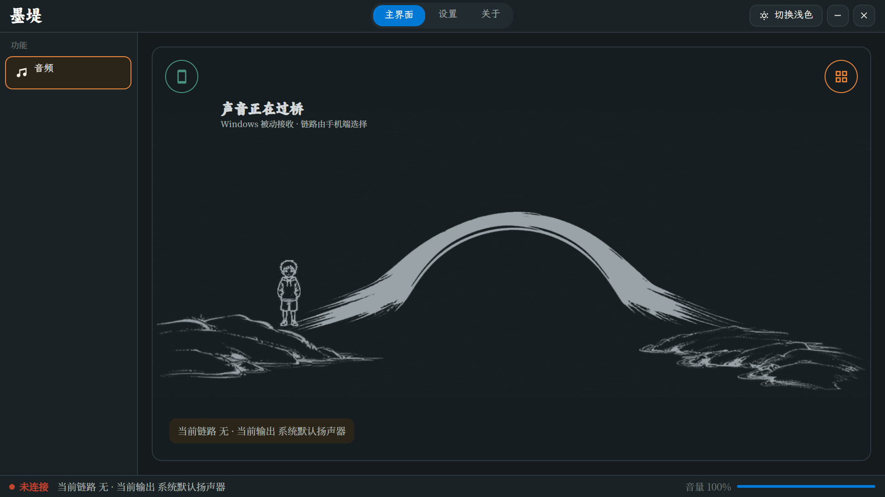
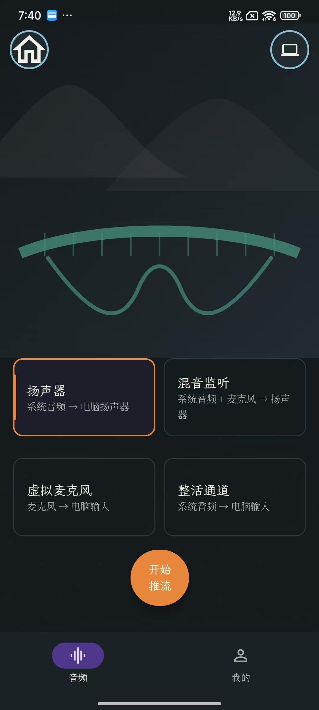

# 墨堤互联 · MoDi Connect

> 1.0 稳定性开发证据见 [Windows 1.0 release evidence](artifacts/release-evidence/windows-1.0/README.md)。自动化门禁已通过；Win10/Win11 实机矩阵仍按模板逐项验收。

> Android 自动化门禁与待完成实机矩阵见 [Android 1.0 release evidence](artifacts/release-evidence/android-1.0/README.md)。

> **跨设备音频互联协议与双端应用** —— 让手机与电脑之间的声音，流动得更自然。

[](LICENSE)
[](https://github.com/DSGYDS/MoDi-Connect-Protocol)
[]()
[](https://modiconnect.cn)

**[官网](https://modiconnect.cn)** · **[下载](https://github.com/DSGYDS/MoDi-Connect/releases)** · **[协议规范](https://github.com/DSGYDS/MoDi-Connect-Protocol)**

墨堤互联是一款开源的跨设备音频互联软件：把手机里的系统声音、麦克风声音，通过**家庭网络 / Wi-Fi Direct / 蓝牙 / USB** 任意一种链路，实时传到电脑上播放，或送入虚拟麦克风供任意软件使用。

---

## ✨ 功能特性

- **四条互联链路**
  - **在家**：局域网 mDNS 自动发现电脑，即开即用
  - **万能**：扫码配对（Wi-Fi Direct），无路由器也能直连
  - **蓝牙 / USB**：经典硬件链路，覆盖无网络场景
- **四种采集路线**
  - 系统音频 → 电脑扬声器
  - 系统音频 + 麦克风混音 → 电脑扬声器
  - 手机麦克风 → 电脑虚拟麦克风（游戏/会议/直播连麦）
  - 系统音频 → 电脑虚拟麦克风
- **低延迟音频链路**：Opus 编码 + JitterBuffer 抗抖动 + FEC 丢包恢复
- **现代水墨风 UI**：Windows / Android 统一设计语言（五字体体系、深浅双主题）
- **推流中热切换**：路线、链路随时切换，不断流

## 📸 截图

| Windows · 真实应用主界面（深色） | Android · 主界面（管线选择 + 推流） |
|:---:|:---:|
|  |  |

---

## 🚀 快速开始

### Windows 端

1. 从 [Releases](https://github.com/DSGYDS/MoDi-Connect/releases) 下载 `MoDi-Win-1.0.0-setup.exe`
2. 运行安装（安装包已内置 .NET 运行时，无需预装任何环境）
3. 如需要使用**虚拟麦克风**（路线 3 / 4），安装完成时勾选运行 **VB-CABLE 引导**（从官方渠道静默安装）

### Android 端

**主界面**从上到下：
- **左上角**链路入口（默认"在家"）：`在家`（局域网）/ `万能`（扫码配对）/ `蓝牙` / `USB`
- **右上角**扫码按钮（万能模式专用）
- **四张管线卡**：`扬声器`（系统音频→电脑音箱）/ `混音监听`（系统+麦克风→音箱）/ `虚拟麦克风`（麦克风→电脑输入）/ `整活通道`（系统音频→电脑输入）
- **底部**：`音效` 页 / **开始推流** 大按钮 / `我的` 页

**连接步骤**：

1. 打开应用，默认在"在家"链路——自动发现局域网电脑（mDNS），点选目标电脑
2. 选择一张**管线卡**（路线）：
   - 手机声音放电脑音箱 → **扬声器**
   - 游戏/会议连麦 → **虚拟麦克风**
3. 点击底部 **开始推流**
4. 推流中可随时切换管线（热切换不断流）；"我的"页提供故事/赞助/技术支持/**官网**入口

**换链路**：左上角切换 `万能`（电脑端显示二维码→手机扫码配对，Wi-Fi Direct 直连）/ `蓝牙` / `USB`——推流中切换会自动先断开旧链路再连新链路。

### 常见用法

| 场景 | 链路 | 路线 |
|------|------|------|
| 把手机声音放电脑音箱 | 在家 | 路线 1（扬声器） |
| 游戏 / 会议连麦 | 万能 | 路线 3（虚拟麦克风） |
| 手机直播伴奏进电脑 | 蓝牙 | 路线 4（整活通道） |

---

## 🔧 从源码构建

### Windows

```bash
dotnet publish windows/MoDi.Desktop/MoDi.Desktop.csproj \
  -c Release -r win-x64 --self-contained true \
  -p:DebugSymbols=false -p:DebugType=None
```

### Android

```bash
cd android
./gradlew :app:assembleRelease
```

> 协议以固定版本二进制（0.1.1）引用，构建前请先放置于 `third_party/modi-protocol/`（见下）。

## 📁 项目结构

```
├── windows/          # Windows 端（Avalonia + C#）
│   ├── MoDi.Desktop/        # 真实应用（接收/配对/音频/路由）
│   ├── MoDi.Presentation/   # 共享水墨 UI（五字体/设计令牌/舞台）
│   └── MoDi.App.Contracts/  # 平台无关契约
├── android/          # Android 端（Jetpack Compose + Kotlin）
│   └── app/src/main/        # 采集/编码/四链路/水墨 UI
├── content/          # 双端共享 Markdown 内容（故事/支持/赞助）
├── third_party/modi-protocol/  # 协议 0.1.1 二进制 + 许可文本
└── scripts/          # 验证/发布脚本
```

## 📄 许可证

- **应用**（本仓库代码）：[GPL-3.0-or-later](LICENSE)
- **MoDi Protocol 0.1.1**：专有许可。应用以二进制形式引用，使用与再分发遵循
  `Licenses/MoDi.Protocol/` 下的 `BINARY-REDISTRIBUTION-GRANT.txt` 与
  `MODI-PROTOCOL-BINARY-LINKING-EXCEPTION-1.0.txt`

## 🏠 社区版与官方发行版

> **重要说明：本仓库（GitHub）发布的是社区版，不包含自动更新机制。**

| | 社区版（本仓库） | 官方发行版 |
|---|---|---|
| 获取渠道 | GitHub 源码 + Releases 双包 | 官网 [modiconnect.cn](https://modiconnect.cn) |
| 源码 | ✅ 完全开放（GPL-3.0） | 与社区版同源 |
| 安装包 | ✅ Releases 提供（setup.exe / APK） | 官网提供 |
| 自动更新 | ❌ **无更新入口**（保持纯净开源） | ✅ 官方更新服务 |
| 增值服务 | — | 见官网 |

- **社区版定位**：面向开发者与爱好者，源码开放、可自由构建、可二次开发
- **官方发行版定位**：面向普通用户，提供自动更新与技术支持等增值服务
- **升级官方版**：请访问官网 [modiconnect.cn](https://modiconnect.cn) 了解详情（**收费增值服务，请以官网说明为准**）
- 两个版本功能主体一致，差异仅在自动更新与官方服务

## ⚠️ 免责声明

本软件仅用于合法、正当的设备互联场景。请勿将本软件用于任何未经授权的录音、监听或侵犯他人隐私的行为。开发者不对任何滥用行为负责。

---

**墨堤互联** —— 从一个声音桥接的想法出发，希望不同设备之间的声音，流动得更自然。
